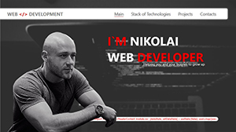
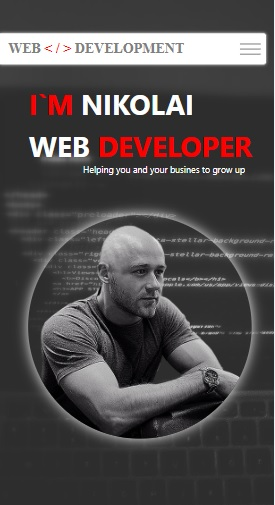

<h1 align="center">Personal Website</h1>
<h2 align="center"><a href="https://nikolai-web.dev">visit website</a></h2>


<p align="center">

</p>


## Description 

This site is my business card. This is the third website I've built from the scratch and the first one I made with React. The site contains standard information with my contacts, completed projects and a list of technologies that I own at the moment. 

## About the project 

Made with React. CSS modules. Hooks I used: useContext, useEffect, useState. Just because there were few "pages", I used states to switch between them, maybe REACT ROUTER was worth it? :). This project taught me how to use animations in CSS and I used them a lot and with pleasure. :) 

## Project setup

```
npm install
npm run 
```
